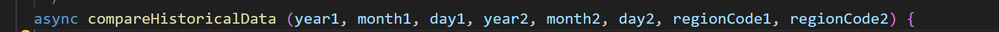
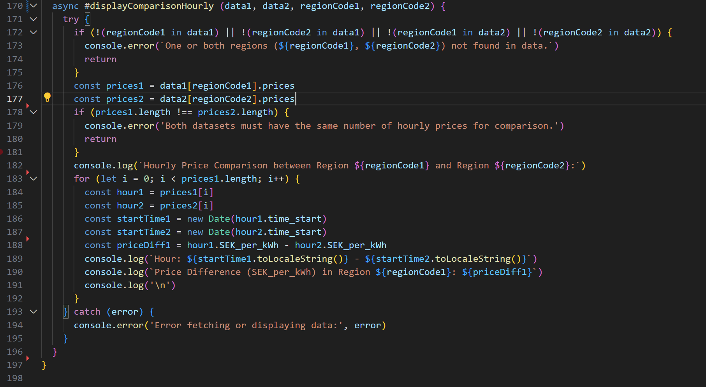

## Reflektion namngivning (kapitel 2)

| Namn och förklarning                   | Reflektion och regler från Clean Code                                                                                                                              |
| -------------------------------------- | ------------------------------------------------------------------------------------------------------------------------------------------------------------------ |
|                                        |                                                                                                                                                                    |
| ElectricityPriceTodayView, klassnamn.  | Class Names/ Dont add Gratuitous Context                                                                                                                           |
|                                        | "Class names" från Clean Code, klasser ska vara ett substantiv och inget verb. "Don't Add Gratuitous Context" från Clean Code, denna regel betonar namn på klasser som bör vara så korta som möjligt samtidigt som de förblir tydliga i sin kontext. Kortare namn är generellt bättre så länge dem fortfarande är tydliga och ger tillräckligt med informationen om vad klassen handlar om. I mitt fall "ElectricityPriceTodayView" känns som ett relevant namn och är kort beskrivande och ger en klar bild över vad klassens syfte är.                                                 |                           
|                                        |                                                                                                                                                                    |
| printHourDataHistorical, metod.        | Use Intention-Revaling Names/ Use Pronounceable Names                                                                                                              |
|                                        | "Use Intention-Revaling Names" från Clean Code, använder namn som avslöjar intentionen, den ska berätta varför den existerar, vad den gör och hur den används. Vilket jag anser att "printHourDataHistorical" gör, den avslöjar intentionen. "Use Pronounceable Names" från Clean Code, lätt uttalat, den visar timpriset och hämtar historiska elprisdata.  Min metod syftar på att skriva ut historisk tim-data för elpriser, jag har övervägt till att ändra metod namnet till "printHistoricalHourlyElectricityPrices", för att göra min metod ännu mer beskrivande. Detta skulle kunna vara en mer detaljerad beskrivning, men jag känner att metodnamnet kommer bli för långt. Jag vill undvika att namnet blir för långt eftersom det kan göra så att läsaren har svårt att uttala metodnamnet. 
|                                        |                                                                                                                                                                    |
| printHistoricalDataCalculation, metod. | Use Intention-Revaling Names/ Use Pronounceable Names                                                                                                              |
|                                        | "Use Intention-Revaling Names" från Clean Code, använder namn som avslöjar intentionen. "Use Pronounceable Names" från Clean Code, lätt uttalat och beskriver sitt syfte. Det är en metod som tar in ett datum, hämtar historisk elprisdata för det datumet och visar sedan den hämtade datan. Jag har funderat mycket över detta namnvalet till metod, men bestämt mig för att behålla det. Samtidigt som jag skrev i övre reflektion att om metodnamet blir för långt kan de bli svårare för läsaren att utala metodnamnet. Just nu känner jag att det är lämpligast att jag behåller namnet även om det är något för långt.                                                                                                                                                                                                                                 |
| compareHistoricalData, metod.          | Method Names/ Make Meaningful Distinctions                                                                                                                                                      |
|                                        | "Method names" från Clean code, metoden ska vara ett verb och beskriva vad metoden gör. Namnet är enkelt och lätt att förstå. "Make Meaningful Distinctions", från Clean Code om argumenten har liknande namn, vill boken att man ska ändra namn till ett mer godtyckligt sätt. Jag har exempelvis två uppsättningar av "year," "month," och "day." Det skulle vara mycket bättre om jag kunde skilja dessa argument på ett bättre/tydligare sätt. I min metod 'compareHistoricalData' har jag argument som representerar år, månad, dag och regionkoder för två olika uppsättningar historisk elprisdata. Namnen på argumenten, som är 'year1,' 'month1,' 'day1,' 'year2,' 'month2,' 'day2,' 'regionCode1,' och 'regionCode2,' ger viss information om innehållet. Men för att göra koden mer förståelig och lättläst övervägde jag att inkludera ytterligare kontext i argumentnamnen. Till exempel, jag skulle kunna använda namn som 'firstYear,' 'firstMonth,' 'firstDay' osv. Dessa namn skulle ge tydligare ledtrådar om vilken uppsättning data varje argument representerar och göra det enklare att förstå koden, särskilt om någon försöker hitta dessa argument i koden senare. 
|                                        |                                                                                                                                                                    |

## Reflektion av kapitel 2 
Sammanfattningsvis verkar min kod följa många av de grundläggande principerna från boken. Under min reflektion insåg jag särskilt att min metod 'compareHistoricalData' har en för stor mängd argument, målet hade varit att ha högst två argument. Jag insåg också att jag behöver förbättra namngivningen kring mina argument för att göra koden mer begriplig i denna metod.
Ytterligare en insikt som jag fick under reflektionen är användningen av ordet 'data', vilket jag har upptäckt att jag använder ganska ofta i mina metodnamn. Till exempel, en av mina metoder i det publika interfacet heter 'printHourDataHistorical'. För att undvika användningen av ordet 'data' skulle metodnamnet kunna se ut så här: 'printHistoricalHourlyElectricityPrices'.
Även om min kod följer många av de regler ifrån Clean Code kapitel 2 föreslår, insåg jag att de finns mycket jag kan förbättras på. Jag kommer försätta tillämpa dessa regler i mina arbeten framöver, då jag anser att de är relevanta för att göra min kod ännu mer läsbar för andra utvecklare och för min egen skull.  

## Reflektion funktioner (kapitel 3)

| Namn och förklarning             | Reflektion och regler från Clean Code |
| -------------------------------- | ------------------------------------- |
| #displayComparisonHourly, metod. | Small!                                |
|                                  | "Small!" från Clean Code, första reglen är att metoder/funktioner ska vara korta. Metoden #displayComparisonHourly i min kod är ett exempel på en metod som jag skulle kunna förbättra enligt reglen om små metoder. Trots att den inte är särskilt lång, består den av cirka 30 rader kod enligt min uppskattning, och det gör den till den längsta metoden i den här klassen. Denna metod ansvarar för att jämföra timvis elprisdata mellan två olika regioner och visar resultatet. Även om metoden är relativt kort, skulle den kunna följa reglen om små metoder ännu bättre genom att bryta ut vissa av de logiska blocken i mindre metoder. Det skulle göra koden mer läsbar.                                        |
|                                  |                                       |
| compareHistoricalData, metod.    | Function Argments                     |
|                                  | Metoden "compareHistoricalData" har ett relativt högt antal argument, nämligen åtta. Detta bryter mot reglen om att minimera antalet argument, vilket Clean Code betonar. Enligt boken är det idealiskt att ha noll argument för en funktion, och om du har tre eller fler argument, bör du överväga att omstrukturera koden för att minska antalet. Detta kan också göra koden mer sårbar för fel och svårare att testa, eftersom man måste hantera olika kombinationer av argumentvärden. Jag kommer definitivt att skriva om denna metod om jag hinner för att göra koden mer i linje med reglerna och därmed kommer de bli lättare att testa och även lättare att underhålla.                                    |
|                                  |                                       |
|#displayRegionHistoricalData      | Use Descriptive Names                 |
|                                  | "Metoden "displayRegionHistoricalData" har ett långt och beskrivande namn. Enligt boken är det viktigt att inte vara rädd för att skapa långa metodnamn, eftersom ett tydligt och beskrivande namn är bättre än en lång kommentar. Genom att använda sådana namn har jag märkt att koden blir mycket mer förståelig, och det sparar mig mycket tid och ansträngning när jag arbetar med koden.                                 |
|                                  |                                       |
|                                  |                                       |
|                                  |                                       |
|                                  |                                       |

## Reflektion av kapitel 3

## Reflektion

Egna erfarenheter från min egna kodkvalitet, anvönd begrepp från boken. 
