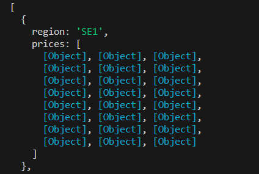

## Testplan

## Caluclator klassen

Test 1.
1. Testa om calculateAvaragePrice - metoden fungerar korrekt med en array med negativa/positiva heltal. 
2. Lägger till en array med bara negativa tal/ positiva tal.  och 
3. Förväntat resultat: Beräknad genomsnittlig pris för negativa och positiva heltal.  

Test 2.
1. Testa om calculateStandardDeviation-metoden fungerar korrekt med en array med positiva/negativa heltal.
2. Förväntat resultat:   

Test 3.
1. Testa om calculateMedianPrice-metoden fungerar korrekt med en array av positiva/negativa heltal.
2. Förväntat resultat:  
   
Test 4.
1. Testa om calculateMinimumPrice-metoden fungerar korrekt med en array som innehåller positiva/negativa heltal.
2. Förväntat resultat:  

Test 5
1. Testa om calculateMaximumPrice-metoden fungerar korrekt med en array som innehåller positiva/negativa heltal.
2. Förväntat resultat:  

Test 6.
1. Öppna terminalen, skriv in npm run test.
2. Alla tester körs och det förväntade resultatet visas i konsolen. 

Förväntat resultat: 

Test 7.
1. Lägger till andra värden för att se om testerna misslyckas.
2. Öppna terminalen och skriv, npm run test. Alla tester körs och resultatet visas i konsolen.
3. Förväntat reultat: 

## Filter klassen

Test 1. 
1. Testa om filterData-metoden i Filter-klassen fungerar korrekt.
2. Testar genom att göra en console.log inuti metoden där den används.  
3. Förväntat resultat: första regionen: 

## PriceLoader klassen

# Metoden getTodayPrice, testas genom konsolen.  
const price = new PriceLoader()
const test = await price.getTodayPrice()
console.log(test) 

Beskrivning
1. Metoden getTodayPrice() testas i app.js
2. Skriv in i terminalen node ./app.js
3. Får ut alla 4 regioners priser
4. Förväntat resultat: 
5. Visar bara region "SE1" på skärmbilden

# Metoden getHistoricalPrice(), testas i konsolen.
const price = new PriceLoader()
const test = await price.getHistoricalPrice(2023, '09', '15')
console.log(test)

Beskrivning
1. Metoden getHistoricalPrice() testas i app.js
2. Skriv in i terminalen node ./app.js
3. Får ut alla 4 regioners priser
4. Förväntat resultat: 
5. Visar bara region "SE1" på skärmbilden

Metoderna #fetchDataAndFilter och #fetchDataElectricity är privata metoder som används i metoderna getTodayPrice() och getHistoricalPrice(). 

## PriceStatisticsGenerator klassen

# Metoden generatePriceStatistics(prices), testas i konsolen. 
const stats = new PriceStatisticsGenerator()
const prices = [
    { SEK_per_kWh: 1.2037 },
    { SEK_per_kWh: 1.15741 },
    { SEK_per_kWh: -1.14894 }
  ]
const test = await stats.generatePriceStatistics(prices)
console.log(test)  

Beskrivning
1. Metoden generatePriceStatistics(prices) testas i app.js
2. Skriv in i terminalen node ./app.js
3. Förväntat resultat: {
  averagePrice: 0.4040566666666667,
  minPrice: -1.14894,
  maxPrice: 1.2037,
  medianPrice: 1.15741,
  standardDeviation: 1.0982970685060072
}

# Metoden generateTodayPriceStatistics testas i konsolen.
const stats = new PriceStatisticsGenerator()
const test = await stats.generateTodayPriceStatistics()
console.log(test)

Beskrivning
1. Metoden generateTodayPriceStatistics testas i app.js
2. Skriv in i terminalen node ./app.js
3. Förväntat resultat för alla 4 regioner: {
  '0': {
    averagePrice: -0.0007870833333333331,
    minPrice: -0.02971,
    maxPrice: 0.02377,
    medianPrice: 0.00006,
    standardDeviation: 0.012844000376040256
  },
  '1': {
    averagePrice: -0.0007870833333333331,
    minPrice: -0.02971,
    maxPrice: 0.02377,
    medianPrice: 0.00006,
    standardDeviation: 0.012844000376040256
  },
  '2': {
    averagePrice: -0.0007870833333333331,
    minPrice: -0.02971,
    maxPrice: 0.02377,
    medianPrice: 0.00006,
    standardDeviation: 0.012844000376040256
  },
  '3': {
    averagePrice: -0.0007870833333333331,
    minPrice: -0.02971,
    maxPrice: 0.02377,
    medianPrice: 0.00006,
    standardDeviation: 0.012844000376040256
  }
}

# Metoden generateHistoricalPriceStatistics testas i konsolen.
const stats = new PriceStatisticsGenerator()
const test = await stats.generateHistoricalPriceStatistics(2023, '09', '15')
console.log(test)

Beskrivning
1. Metoden generateHistoricalPriceStatistics testas i app.js
2. Skriv in i terminalen node ./app.js
3. Förväntat resultat för alla 4 regioner: {
  '0': {
    averagePrice: 0.16841874999999998,
    minPrice: 0.07182,
    maxPrice: 0.20509,
    medianPrice: 0.17479,
    standardDeviation: 0.03194412156569917
  },
  '1': {
    averagePrice: 0.16841874999999998,
    minPrice: 0.07182,
    maxPrice: 0.20509,
    medianPrice: 0.17479,
    standardDeviation: 0.03194412156569917
  },
  '2': {
    averagePrice: 0.29791291666666664,
    minPrice: 0.07182,
    maxPrice: 1.49218,
    medianPrice: 0.178425,
    standardDeviation: 0.3405331338318291
  },
  '3': {
    averagePrice: 1.2852854166666667,
    minPrice: 0.75033,
    maxPrice: 2.2653,
    medianPrice: 1.1719650000000001,
    standardDeviation: 0.34217508620075343
  }
}  

## ElectricityPriceTodayViewv klassen

# Metoden displayHourPrice testas i konsolen.
const display = new ElectricityPriceTodayView()
const regionCode = 0
const stats = {
  prices: [
    {
      time_start: '2023-09-25T08:00:00Z',
      time_end: '2023-09-25T09:00:00Z',
      SEK_per_kWh: 0.12,
      EUR_per_kWh: 0.01
    }
  ]
}
display.displayHourPrice(regionCode, stats)

Beskrivning
1. Metoden displayHourPrice testas i app.js
2. Skriv in i terminalen node ./app.js
3. Förväntat resultat för (Norra Sverige): 
Price for Region: 0 (Norra Sverige)
Start Time: 2023-09-25 10:00:00
End Time: 2023-09-25 11:00:00
SEK_per_kWh: 0.12
EUR_per_kWh: 0.01

# Metoden displayTodayData testas i konsolen.
const display = new ElectricityPriceTodayView()
const regionCode = 0
const stats = {
    averagePrice: 0.12222,
    minPrice: 0.1333,
    maxPrice: 0.15441,
    medianPrice: 0.132,
    standardDeviation: 0.023333
  }
display.displayTodayData(regionCode, stats)

Beskrivning
1. Metoden displayTodayData testas i app.js
2. Skriv in i terminalen node ./app.js
3. Förväntat resultat för (Norra Sverige): 
Today's Price Calculation:
Region: 0 (Norra Sverige)
Average Price: 0.12222
Min Price: 0.1333
Max Price: 0.15441
Median Price: 0.132
Standard Deviation Price: 0.023333

# Metoden handleError testas i konsolen.
const display = new ElectricityPriceTodayView()
const data = [
]
display.handleError(data)

Beskrivning
1. Metoden handleError testas i app.js
2. Skriv in i terminalen node ./app.js
3. Förväntat resultat: 
Error fetching or displaying data: []

# Metoden printTodayDataCalculation testas i konsolen.

const display = new ElectricityPriceTodayView()
display.printTodayDataCalculation()

Beskrivning
1. Metoden printTodayDataCalculation testas i app.js
2. Skriv in i terminalen node ./app.js
3. Förväntat resultat:
Today's Price Calculation:
Region: 0 (Norra Sverige)
Average Price: 0.12222
Min Price: 0.1333
Max Price: 0.15441
Median Price: 0.132
Standard Deviation Price: 0.023333
PS C:\Users\nossf\Documents\1dv610\L2\L2\test> node .\app.js
Today's Price Calculation:
Region: 0 (Norra Sverige)
Average Price: -0.0007870833333333331
Min Price: -0.02971
Max Price: 0.02377
Median Price: 0.00006
Standard Deviation Price: 0.012844000376040256
Today's Price Calculation:
Region: 1 (Norra mellan Sverige)
Average Price: -0.0007870833333333331
Min Price: -0.02971
Max Price: 0.02377
Median Price: 0.00006
Standard Deviation Price: 0.012844000376040256
Today's Price Calculation:
Region: 2 (Södra mellan Sverige)
Average Price: -0.0007870833333333331
Min Price: -0.02971
Max Price: 0.02377
Median Price: 0.00006
Standard Deviation Price: 0.012844000376040256
Today's Price Calculation:
Region: 3 (Södra Sverige)
Average Price: -0.0007870833333333331
Min Price: -0.02971
Max Price: 0.02377
Median Price: 0.00006
Standard Deviation Price: 0.012844000376040256

# Metoden printHourDataToday testas i konsolen.

const display = new ElectricityPriceTodayView()
display.printHourDataToday()

Beskrivning
1. Metoden printHourDataToday testas i app.js
2. Skriv in i terminalen node ./app.js
3. Förväntat resultat för en timme för region (Norra Sverige): Price for Region: 0 (Norra Sverige)
Start Time: 2023-09-25 00:00:00
End Time: 2023-09-25 01:00:00
SEK_per_kWh: 0.00285
EUR_per_kWh: 0.00024

Start Time: 2023-09-25 01:00:00
End Time: 2023-09-25 02:00:00
SEK_per_kWh: -0.00012
EUR_per_kWh: -0.00001
4. De förväntade datan för alla regioner kom med i konsolen men ansåg att det var för mycket att klistra in här. 

# Metoden fetchTodayData testas i konsolen. 
const display = new ElectricityPriceTodayView()
const fetch = await display.fetchTodayData()
console.log(fetch)

Beskrivning
1. Metoden fetchTodayData testas i app.js
2. Skriv in i terminalen node ./app.js
3. Förväntat resultat: {
  '0': {
    averagePrice: -0.0007870833333333331,
    minPrice: -0.02971,
    maxPrice: 0.02377,
    medianPrice: 0.00006,
    standardDeviation: 0.012844000376040256
  },
  '1': {
    averagePrice: -0.0007870833333333331,
    minPrice: -0.02971,
    maxPrice: 0.02377,
    medianPrice: 0.00006,
    standardDeviation: 0.012844000376040256
  },
  '2': {
    averagePrice: -0.0007870833333333331,
    minPrice: -0.02971,
    maxPrice: 0.02377,
    medianPrice: 0.00006,
    standardDeviation: 0.012844000376040256
  },
  '3': {
    averagePrice: -0.0007870833333333331,
    minPrice: -0.02971,
    maxPrice: 0.02377,
    medianPrice: 0.00006,
    standardDeviation: 0.012844000376040256
  }
}

# Metoden fetchHourData testas i konsolen.

const display = new ElectricityPriceTodayView()
const fetch = await display.fetchHourData()
console.log(fetch)

Beskrivning
1. Metoden fetchTodayData testas i app.js
2. Skriv in i terminalen node ./app.js
3. Förväntat resultat: [
  {
    region: 'SE1',
    prices: [
      [Object], [Object], [Object],
      [Object], [Object], [Object],
      [Object], [Object], [Object],
      [Object], [Object], [Object],
      [Object], [Object], [Object],
      [Object], [Object], [Object],
      [Object], [Object], [Object],
      [Object], [Object], [Object]
    ]
  },
  {
    region: 'SE2',
    prices: [
      [Object], [Object], [Object],
      [Object], [Object], [Object],
      [Object], [Object], [Object],
      [Object], [Object], [Object],
      [Object], [Object], [Object],
      [Object], [Object], [Object],
      [Object], [Object], [Object],
      [Object], [Object], [Object]
    ]
  },
  {
    region: 'SE3',
    prices: [
      [Object], [Object], [Object],
      [Object], [Object], [Object],
      [Object], [Object], [Object],
      [Object], [Object], [Object],
      [Object], [Object], [Object],
      [Object], [Object], [Object],
      [Object], [Object], [Object],
      [Object], [Object], [Object]
    ]
  },
  {
    region: 'SE4',
    prices: [
      [Object], [Object], [Object],
      [Object], [Object], [Object],
      [Object], [Object], [Object],
      [Object], [Object], [Object],
      [Object], [Object], [Object],
      [Object], [Object], [Object],
      [Object], [Object], [Object],
      [Object], [Object], [Object]
    ]
  }
]

## ElectricityPriceHistoricalView klassen

# Metoden printHourDataHistorical testas i konsolen.

const display = new ElectricityPriceHistoricalView()

display.printHourDataHistorical(2023, '08', '15')

Beskrivning
1. Metoden printHourDataHistorical testas i app.js
2. Skriv in i terminalen node ./app.js
3. Förväntat resultat: Price for Region: 3 (Södra Sverige)
Start Time: 2023-08-15 00:00:00
End Time: 2023-08-15 01:00:00
SEK_per_kWh: 0.20155
EUR_per_kWh: 0.01704

Start Time: 2023-08-15 01:00:00
End Time: 2023-08-15 02:00:00
SEK_per_kWh: 0.18925
EUR_per_kWh: 0.016
4. De förväntade datan för alla regioner kom med i konsolen men ansåg att det var för mycket att klistra in här.

# Metoden printHistoricalDataCalculation testas i konsolen.

const display = new ElectricityPriceHistoricalView()

display.printHistoricalDataCalculation(2023, '08', '15')

Beskrivning
1. Metoden printHistoricalDataCalculation testas i app.js
2. Skriv in i terminalen node ./app.js
3. Förväntat resultat: Historical Data Calculation:
Region: 0 (Norra Sverige)
Average Price: 0.25411375
Min Price: 0.17612
Max Price: 0.33048
Median Price: 0.27127999999999997
Standard Deviation Price: 0.046007142091608985
Historical Data Calculation:
Region: 1 (Norra mellan Sverige)
Average Price: 0.25411375
Min Price: 0.17612
Max Price: 0.33048
Median Price: 0.27127999999999997
Standard Deviation Price: 0.046007142091608985
Historical Data Calculation:
Region: 2 (Södra mellan Sverige)
Average Price: 0.25410958333333333
Min Price: 0.17612
Max Price: 0.33047
Median Price: 0.271275
Standard Deviation Price: 0.04600476048548007
Historical Data Calculation:
Region: 3 (Södra Sverige)
Average Price: 0.42555708333333336
Min Price: 0.17612
Max Price: 1.45533
Median Price: 0.272875
Standard Deviation Price: 0.35948853470914255

# Metoden fetchHistoricalData testas i konsolen.

const display = new ElectricityPriceHistoricalView()
const fetch = await display.fetchHistoricalData(2023, '08', '15')
console.log(fetch)

Beskrivning
1. Metoden fetchHistoricalData testas i app.js
2. Skriv in i terminalen node ./app.js
3. Förväntat resultat: {
  '0': {
    averagePrice: 0.25411375,
    minPrice: 0.17612,
    maxPrice: 0.33048,
    medianPrice: 0.27127999999999997,
    standardDeviation: 0.046007142091608985
  },
  '1': {
    averagePrice: 0.25411375,
    minPrice: 0.17612,
    maxPrice: 0.33048,
    medianPrice: 0.27127999999999997,
    standardDeviation: 0.046007142091608985
  },
  '2': {
    averagePrice: 0.25410958333333333,
    minPrice: 0.17612,
    maxPrice: 0.33047,
    medianPrice: 0.271275,
    standardDeviation: 0.04600476048548007
  },
  '3': {
    averagePrice: 0.42555708333333336,
    minPrice: 0.17612,
    maxPrice: 1.45533,
    medianPrice: 0.272875,
    standardDeviation: 0.35948853470914255
  }
}

# Metoden fetchHistoricalHourPrice testas i konsolen.

Testfall där argument finns med:
const display = new ElectricityPriceHistoricalView()
const fetch = await display.fetchHistoricalHourPrice(2023, '08', '15')
console.log(fetch)

Beskrivning
1. Metoden fetchHistoricalHourPrice testas i app.js
2. Skriv in i terminalen node ./app.js
3. Förväntat resultat: 
[
  {
    region: 'SE1',
    prices: [
      [Object], [Object], [Object],
      [Object], [Object], [Object],
      [Object], [Object], [Object],
      [Object], [Object], [Object],
      [Object], [Object], [Object],
      [Object], [Object], [Object],
      [Object], [Object], [Object],
      [Object], [Object], [Object]
    ]
  },
]
4. De förväntade datan för alla regioner kom med i konsolen men ansåg att det var för mycket att klistra in här.

Testfall där argument inte finns med:
const display = new ElectricityPriceHistoricalView()
const fetch = await display.fetchHistoricalHourPrice()
console.log(fetch)

Beskrivning
1. Metoden fetchHistoricalHourPrice testas i app.js
2. Skriv in i terminalen node ./app.js
3. Förväntat resultat: 
Error fetching or processing data: Error: Failed to fetch data for region SE1...

# Metoden displayHistoricalData testas i konsolen.

const display = new ElectricityPriceHistoricalView()
const priceStatisticsHistorical = {
    0: {
      averagePrice: 0.11,
      minPrice: 0.052,
      maxPrice: 0.153,
      medianPrice: 0.1323,
      standardDeviation: 0.102344
    },
    1: {
      averagePrice: 0.08,
      minPrice: 0.03,
      maxPrice: 0.12,
      medianPrice: 0.1323,
      standardDeviation: 0.1023
    }
  }
const fetch = await display.displayHistoricalData(priceStatisticsHistorical)
console.log(fetch)

Beskrivning
1. Metoden fetchHistoricalHourPrice testas i app.js
2. Skriv in i terminalen node ./app.js
3. Förväntat resultat: Historical Data Calculation:
Region: 0 (Norra Sverige)
Average Price: 0.11
Min Price: 0.052
Max Price: 0.153
Median Price: 0.1323
Standard Deviation Price: 0.102344
Historical Data Calculation:
Region: 1 (Norra mellan Sverige)
Average Price: 0.08
Min Price: 0.03
Max Price: 0.12
Median Price: 0.1323
Standard Deviation Price: 0.1023

# Metoden displayHourPriceHistorical testas i konsolen.

const display = new ElectricityPriceHistoricalView()
const stats = {
    0: {
        prices: [
          {
            time_start: '2023-09-23T08:00:00Z',
            time_end: '2023-09-23T09:00:00Z',
            SEK_per_kWh: 0.12,
            EUR_per_kWh: 0.01
          }
        ]
      },
  }
const fetch = await display.displayHourPriceHistorical(stats)
console.log(fetch)

Beskrivning
1. Metoden displayHourPriceHistorical testas i app.js
2. Skriv in i terminalen node ./app.js
3. Förväntat resultat:
Price for Region: 0 (Norra Sverige)
Start Time: 2023-09-23 10:00:00
End Time: 2023-09-23 11:00:00
SEK_per_kWh: 0.12
EUR_per_kWh: 0.01

# Metoden displayRegionHourPrice testas i konsolen.

const display = new ElectricityPriceHistoricalView()
const regionCode = 0
const stats = {
  prices: [
    {
      time_start: '2023-09-25T08:00:00Z',
      time_end: '2023-09-25T09:00:00Z',
      SEK_per_kWh: 0.12,
      EUR_per_kWh: 0.01
    }
  ]
}

const fetch = display.displayRegionHourPrice(regionCode, stats)
console.log(fetch)

Beskrivning
1. Metoden displayHourPriceHistorical testas i app.js
2. Skriv in i terminalen node ./app.js
3. Förväntat resultat:
Price for Region: 0 (Norra Sverige)
Start Time: 2023-09-25 10:00:00
End Time: 2023-09-25 11:00:00
SEK_per_kWh: 0.12
EUR_per_kWh: 0.01

# Metoden displayRegionHistoricalData testas i konsolen.

const display = new ElectricityPriceHistoricalView()
const regionCode1 = 0
const stats = {
      averagePrice: 0.11,
      minPrice: 0.052,
      maxPrice: 0.153,
      medianPrice: 0.1323,
      standardDeviation: 0.102344
    }

const fetch = display.displayRegionHistoricalData(regionCode1, stats)
console.log(fetch)

Beskrivning
1. Metoden displayHourPriceHistorical testas i app.js
2. Skriv in i terminalen node ./app.js
3. Förväntat resultat: 
Historical Data Calculation:
Region: 0 (Norra Sverige)
Average Price: 0.11
Min Price: 0.052
Max Price: 0.153
Median Price: 0.1323
Standard Deviation Price: 0.102344

# Metoden compareHistoricalData testas i konsolen.

const displayHistorical = new ElectricityPriceHistoricalView()

const year1 = 2023
const month1 = '08'
const day1 = '16'

const year2 = 2023
const month2 = '09'
const day2 = '18'

const regionCode1 = '0'
const regionCode2 = '3'

displayHistorical.compareHistoricalData(year1, month1, day1, year2, month2, day2, regionCode1, regionCode2)

Beskrivning
1. Metoden compareHistoricalData testas i app.js
2. Skriv in i terminalen node ./app.js
3. Förväntat resultat: 
Hourly Price Comparison between Region 0 and Region 3:
Hour: 2023-08-16 00:00:00 - 2023-09-18 00:00:00
Price Difference (SEK_per_kWh) in Region 0: 0.06711

Hour: 2023-08-16 01:00:00 - 2023-09-18 01:00:00
Price Difference (SEK_per_kWh) in Region 0: 0.07214999999999999
4. De förväntade data för alla regioner kom med i konsolen men ansåg att det var för mycket att visa.

# Metoden displayComparisonHourly testas i konsolen.

 Metoden #displayComparisonHourly är en privat metod som används i metoden compareHistoricalData.
 Den testas genom att:
 async displayComparisonHourly (data1, data2, regionCode1, regionCode2) {
    console.log(data1, data2, regionCode1, regionCode2)
 }

 1. Skrev dit en console.log inuti metoden.
 2. Metoden testas genom compareHistoricalData. 
 3. Förväntat resultat: [
  {
    region: 'SE1',
    prices: [
      [Object], [Object], [Object],
      [Object], [Object], [Object],
      [Object], [Object], [Object],
      [Object], [Object], [Object],
      [Object], [Object], [Object],
      [Object], [Object], [Object],
      [Object], [Object], [Object],
      [Object], [Object], [Object]
    ]
  },
 ]
 4. Data för två olika dagar, tog inte med all data för ansåg att det var för mycket att visa.
 5. Region 1 och 3 kom med i konsolen som jag skrev i app.js.
  const year1 = 2023
  const month1 = '08'
  const day1 = '16'
  const year2 = 2023
  const month2 = '09'
  const day2 = '18'
  const regionCode1 = '1'
  const regionCode2 = '3'

displayHistorical.compareHistoricalData(year1, month1, day1, year2, month2, day2, regionCode1, regionCode2)

 
