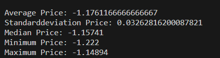

## Testplan

## Caluclator klassen

Test 1.
1. Testa om calculateAvaragePrice - metoden fungerar korrekt med en array med negativa/positiva helttal. 
2. Lägger till en array med bara negativa tal/ positiva tal.  och 
3. Förväntat resultat: Beräknad genomsnittlig pris för negativa och positiva heltal.  

Test 2.
1. Testa om calculateStandardDeviation-metoden fungerar korrekt med en array med positiva/negativa heltal.
2. Förväntat resultat:   

Test 3.
1. Testa om calculateMedianPrice-metoden fungerar korrekt med en array av positiva/negativa heltal.
2. Förväntat resultat:  
   
Test 4.
1. Testa om calculateMinimumPrice-metoden fungerar korrekt med en array som innehåller positiva/negativa heltal.
2. Förväntat resultat:  

Test 5
1. Testa om calculateMaximumPrice-metoden fungerar korrekt med en array som innehåller positiva/negativa heltal.
2. Förväntat resultat:  

Test 6.
1. Öppna terminalen, skriv in npm run test.
2. Alla tester körs och det förväntade resultatet visas i konsolen. 

Förväntat resultat: 

Test 7.
1. Lägger till andra värden för att se om testerna misslyckas.
2. Öppna terminalen och skriv, npm run test. Alla tester körs och resultatet visas i konsolen.
3. Förväntat reultat: 

## Filter klassen

Test 1. 
1. Testa om filterData-metoden i Filter-klassen fungerar korrekt.
2. Testar genom att göra en console.log inuti metoden där den används.  
3. Förväntat resultat: första regionen: 

## PriceLoader klassen

Metoden getTodayPrice, testat genom konsolen.  
const price = new PriceLoader()
const test = await price.getTodayPrice()
console.log(test) 

Beskrivning
1. Metoden getTodayPrice() testas i app.js
2. Skriv in i terminalen node ./app.js
3. Får ut alla 4 regioners priser
4. Förväntat resultat: 
5. Visar bara region "SE1" på skärmbilden

Metoden getHistoricalPrice(), testas i konsolen.
const price = new PriceLoader()
const test = await price.getHistoricalPrice(2023, '09', '15')
console.log(test)

Beskrivning
1. Metoden getHistoricalPrice() testas i app.js
2. Skriv in i terminalen node ./app.js
3. Får ut alla 4 regioners priser
4. Förväntat resultat: 
5. Visar bara region "SE1" på skärmbilden

Metoderna #fetchDataAndFilter och #fetchDataElectricity är privata metoder som används i metoderna getTodayPrice() och getHistoricalPrice(). 

## PriceStatisticsGenerator klassen

Metoden generatePriceStatistics(prices), testas i konsolen. 
const stats = new PriceStatisticsGenerator()
const prices = [
    { SEK_per_kWh: 1.2037 },
    { SEK_per_kWh: 1.15741 },
    { SEK_per_kWh: -1.14894 }
  ]
const test = await stats.generatePriceStatistics(prices)
console.log(test)  
Beskrivning
1. Metoden generatePriceStatistics(prices) testas i app.js
2. Skriv in i terminalen node ./app.js
3. Förväntat resultat: {
  averagePrice: 0.4040566666666667,
  minPrice: -1.14894,
  maxPrice: 1.2037,
  medianPrice: 1.15741,
  standardDeviation: 1.0982970685060072
}

Metoden generateTodayPriceStatistics testas i konsolen.
const stats = new PriceStatisticsGenerator()
const test = await stats.generateTodayPriceStatistics()
console.log(test)

Beskivning
1. Metoden generateTodayPriceStatistics testas i app.js
2. Skriv in i terminalen node ./app.js
3. Förväntat resultat för alla 4 regioner: {
  '0': {
    averagePrice: -0.0007870833333333331,
    minPrice: -0.02971,
    maxPrice: 0.02377,
    medianPrice: 0.00006,
    standardDeviation: 0.012844000376040256
  },
  '1': {
    averagePrice: -0.0007870833333333331,
    minPrice: -0.02971,
    maxPrice: 0.02377,
    medianPrice: 0.00006,
    standardDeviation: 0.012844000376040256
  },
  '2': {
    averagePrice: -0.0007870833333333331,
    minPrice: -0.02971,
    maxPrice: 0.02377,
    medianPrice: 0.00006,
    standardDeviation: 0.012844000376040256
  },
  '3': {
    averagePrice: -0.0007870833333333331,
    minPrice: -0.02971,
    maxPrice: 0.02377,
    medianPrice: 0.00006,
    standardDeviation: 0.012844000376040256
  }
}

Metoden generateHistoricalPriceStatistics testas i konsolen.
const stats = new PriceStatisticsGenerator()
const test = await stats.generateHistoricalPriceStatistics(2023, '09', '15')
console.log(test)

Beskivning
1. Metoden generateHistoricalPriceStatistics testas i app.js
2. Skriv in i terminalen node ./app.js
3. Förväntat resultat för alla 4 regioner: {
  '0': {
    averagePrice: 0.16841874999999998,
    minPrice: 0.07182,
    maxPrice: 0.20509,
    medianPrice: 0.17479,
    standardDeviation: 0.03194412156569917
  },
  '1': {
    averagePrice: 0.16841874999999998,
    minPrice: 0.07182,
    maxPrice: 0.20509,
    medianPrice: 0.17479,
    standardDeviation: 0.03194412156569917
  },
  '2': {
    averagePrice: 0.29791291666666664,
    minPrice: 0.07182,
    maxPrice: 1.49218,
    medianPrice: 0.178425,
    standardDeviation: 0.3405331338318291
  },
  '3': {
    averagePrice: 1.2852854166666667,
    minPrice: 0.75033,
    maxPrice: 2.2653,
    medianPrice: 1.1719650000000001,
    standardDeviation: 0.34217508620075343
  }
}  

